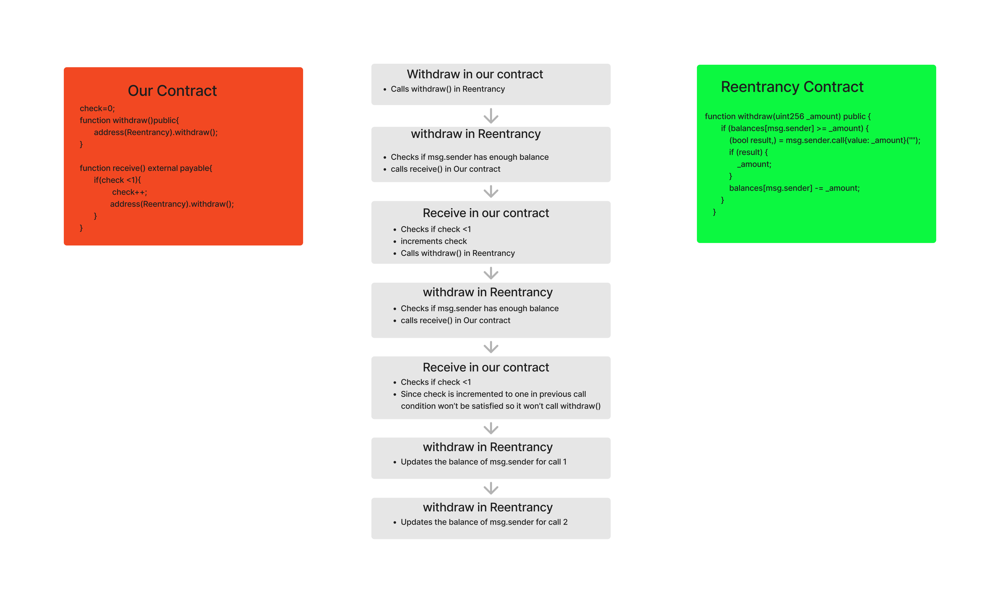
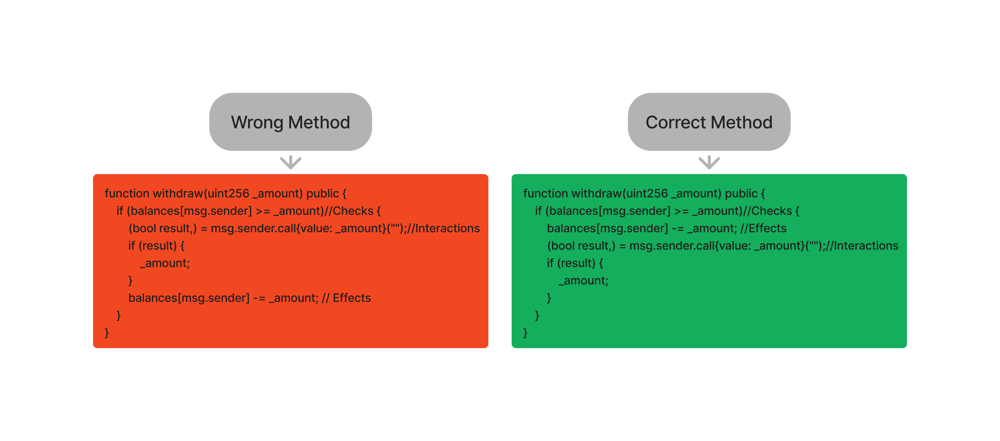

# Writeup for Re-entrancy

- Hello h4ck3r, welcome to the world of smart contract hacking. Solving the challenges from Ethernaut will help you understand Solidity better. For each challenge, a contract will be deployed, and an instance will be provided. Your task is to interact with the contract and exploit its vulnerabilities. Don't worry if you are new to Solidity and have never deployed a smart contract before. You can learn how to deploy a contract using Remix [here](https://youtu.be/3xNFZI8Ste4?si=i3cWN87OpX85zp6k).

### Challenge Description

The goal of this level is for you to steal all the funds from the contract.

Things that might help:

- Untrusted contracts can execute code where you least expect it.
- Fallback methods
- Throw/revert bubbling
- Sometimes the best way to attack a contract is with another contract.
- See the "?" page above, section "Beyond the console"

### Contract Explanation

Click [here](./src/contracts/Reentrance.sol) to view the contract.

If you feel like you understand the contract, you can move to the [exploit](#exploit) part. If you are a beginner, please go through the Contract Explanation as well. It will help you understand Solidity better.

Since the contract version is less than 0.8.0, they are using the `SafeMath` library to prevent overflows and underflows.

The contract stores balances of people who donated to the contract using a mapping from address to uint256, stored in a variable called `balances`.

```solidity
function donate(address _to) public payable {
    balances[_to] = balances[_to].add(msg.value);
}
```

The function `donate()` is a `public` `payable` function, which means it will accept sending `ether` during the function call. It takes an argument of type `address`. In the logic, it updates the balances of the address passed as an argument with the ether sent during the call.

```solidity
function balanceOf(address _who) public view returns (uint256 balance) {
    return balances[_who];
}
```

The function `balanceOf()` is a public view function, which means it only reads from the contract. It takes an argument of type address and returns the balance of the address passed as an argument.

```solidity
function withdraw(uint256 _amount) public {
    if (balances[msg.sender] >= _amount) {
    (bool result,) = msg.sender.call{value: _amount}("");
        if (result) {
        _amount;
        }
    balances[msg.sender] -= _amount;
    }
}
```

The function `withdraw()` is a public function. It takes an argument of type uint256. The function checks if the `msg.sender` (caller) has enough balance. If the caller has enough balance, it transfers the specified amount of ether to the caller using a low-level call. After the call, it reduces the balance of the caller.

```solidity
receive() external payable {}
```

The function `receive()` is a special function in Solidity. It is triggered when someone sends ether to the contract without calling any other function in the contract. There is no logic in this function; it simply accepts ether payments without making any state changes.

### Exploit

Before getting started with the exploit, I wanted to ask a question. What is the name of the challenge? REENTRANCY!! What does REENTRANCY mean? Basically entering again and again.

If we observe the `withdraw()` function, when someone calls the withdraw function, it transfers the ether and then updates the balance. But how is it transferring the ether and updating the balance?

It is transferring the ether using the `low-level` call function. When transferring ether using a low-level call, if the receiver is an `Externally Owned Account` (EOA) account, the account will receive the ether. However, if the receiver is a contract account, the contract will only receive the ether if it has a `receive()` function. If there is no `receive()` function, the ether won't be transferred.

`receive()` is a function where we can write some logic. Now, let's assume we made some deposits for a contract that we deployed, and we called the `withdraw()` function using our contract. It will check if there is a `receive()` function or not. If there is a `receive()` function in our deployed contract, our contract will successfully receive the ether and our balance will be updated.

Now, what if we write some logic in our contract's `receive()` function to call the `withdraw()` function again? The `withdraw()` function will be called again before updating the balances of our first withdraw call, which means we still have the balances even after withdrawing. The checks in the `withdraw()` function for the second call will be passed, and our contract will receive the ether again. This process can continue indefinitely, but we will encounter an `out of gas` error.

The `out of gas` error occurs because, in a transaction, we can use a maximum of `3 million` gas. If we use more gas than the limit, we will get an error. As the logic we wrote creates an infinite loop, we need to change it so that we just drain the contract.

Another thing to consider is that the balance is updated after the calls. Let's assume in our `receive()` function, we just write the logic to call the `withdraw()` function twice. The calls will be as follows:

<p align="center">
  
</p>

The key point to understand in the flowchart is that the balance is updated at last and it is updated twice. Suppose we have `1 ether` and we withdraw `1 ether` in each call. At last, our balance will be reduced twice. When it reduces the first time, our balance will be `zero`, and the next time it reduces, there should be an `underflow` or `revert` if the `underflow` is handled properly. If it reverts, all the state changes made will be reverted.

If we check the `Reentrance` contract, the compiler version is less than 0.8.0, which means the contract is vulnerable to `overflows` and `underflows`. However, they are using the `SafeMath` library to overcome the vulnerabilities of overflows and underflows. If we check the `donate()` function, they have properly implemented the `SafeMath` library. But if we check the `withdraw()` function, they didn't use the `SafeMath` library to reduce the caller's balance. The correct syntax for implementing SafeMath for subtraction is `balances[msg.sender].sub(_amount)`.

So, as they didn't use SafeMath during the second call while updating the balance, it will lead to an underflow, and our balance will be set to `(2^256 - 1)`. With these two vulnerabilities, we can withdraw twice the amount of our balance in the Reentrancy contract.

**Note:** I have written logic to withdraw twice, but it is not limited to that. We can withdraw as many times as we want as long as the contract has a balance.

Now our task is to know the balance of the contract, then donate ether worth the Reentrancy contract balance to our Exploit contract, and use the contract to call the `withdraw()` function.

Now, it's time to open the console. Open the **Reentrancy** challenge and press `ctrl`+`shift`+`j` to open the console.

```javascript
> await web3.eth.getBalance(contract.address)
```

This will return the balance of the Reentrance contract. The balance of the Reentrance contract is `1000000000000000 wei`.

Now we need to write an Exploit contract. Click [here](./Exploit/ExploitReentrancy.sol) to view the exploit contract.

To completely drain the `Reentrance` contract, we need to call the `Exploit()` function. Once we call the `Exploit()`, the Reentrance contract balance will become zero, and our Exploit contract balance will become `2000000000000000 wei` or `0.002 ether`.

Lastly, don't forget to withdraw 0.002 ether from the Exploit contract to your EOA.

That's it! Now we can submit the instance.

### Key Takeaways

When our contract logic involves sending ether based on balances, we must adopt the CEI pattern (Checks, Effects, Interactions). First, check for the balance, update the balance, and then proceed with the transfer. Compare the below and try to understand the difference.

<p align="center">
  
</p>

<p style="text-align:center;">***<strong>Hope you enjoyed this write-up. Keep on hacking and learning!</strong>***</p>
